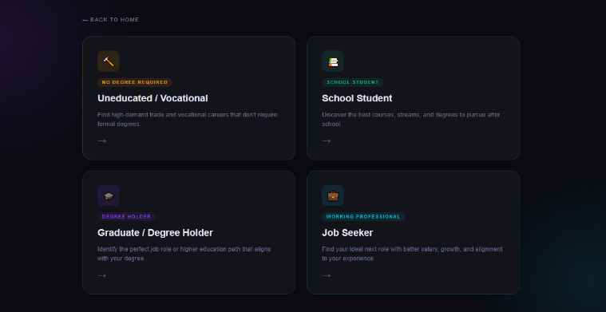
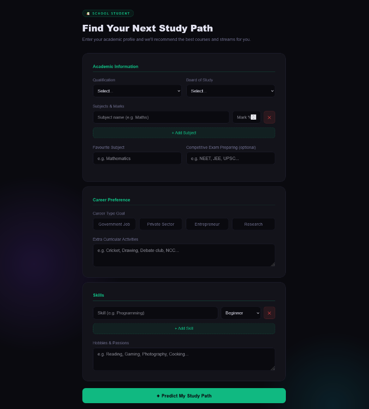
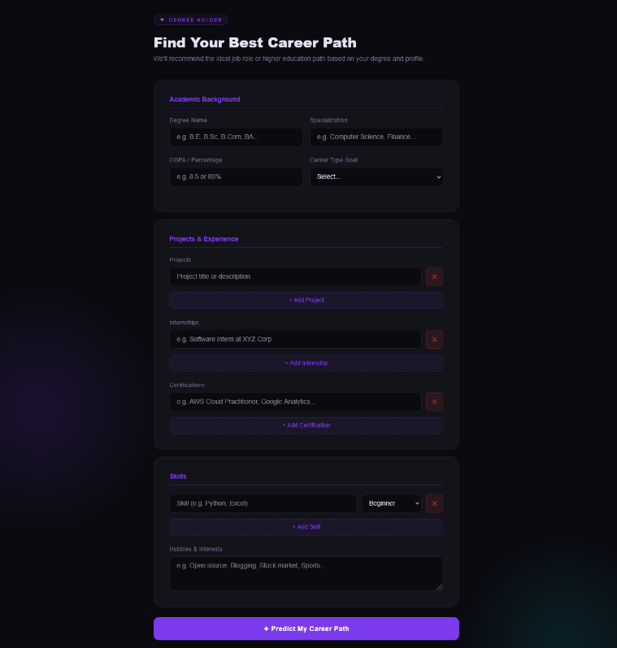
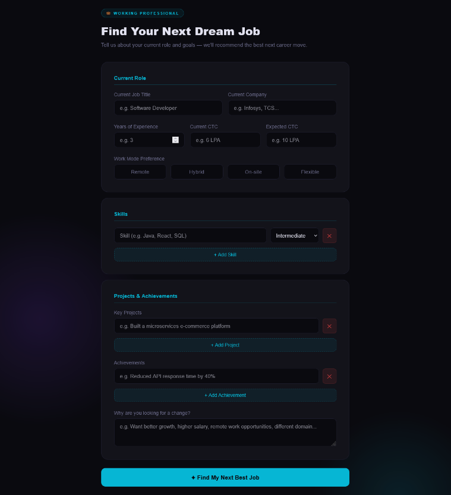
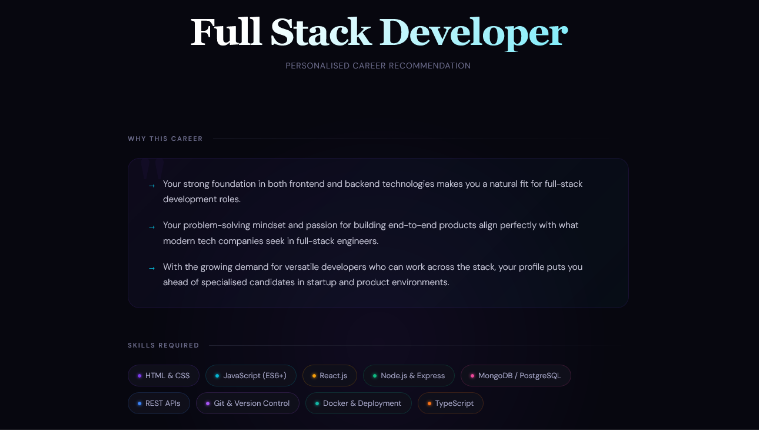
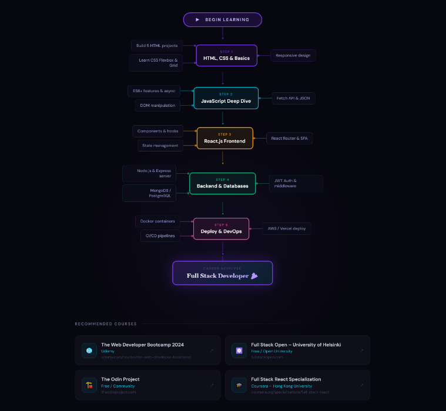

# 🚀 CareerPath AI — Intelligent Career Recommendation System

<p align="center">
  
</p>

<h1 align="center">CareerPath AI</h1>

<p align="center">
AI-powered Career Prediction & Recommendation System using FastAPI, RAG, ChromaDB, Ollama LLM, and Modern Responsive UI.
</p>

<p align="center">
  
  
  
  
</p>

---

# 🌟 About The Project

CareerPath AI is an advanced AI-powered career guidance platform designed to help users discover the most suitable career path based on their education, skills, interests, and goals.

The system uses:

✅ RAG (Retrieval-Augmented Generation)  
✅ FastAPI Backend  
✅ Ollama Local LLM  
✅ ChromaDB Vector Database  
✅ Modern Responsive Frontend  
✅ AI-Based Career Prediction  

The application supports multiple user categories:

- 🎓 Graduates
- 📚 School Students
- 💼 Job Seekers
- 🔨 Vocational / Uneducated Users

The system analyzes user input and generates:

- Personalized career recommendations
- Required skills
- Learning roadmap
- Online course suggestions
- Career growth guidance

---

# 🌐 Core Technologies Used

| Technology | Purpose |
|------------|----------|
| FastAPI | Backend Framework |
| Python | Core Programming |
| Ollama | Local LLM Integration |
| ChromaDB | Vector Database |
| Sentence Transformers | Embedding Model |
| HTML5 | Frontend Structure |
| CSS3 | Styling |
| JavaScript | Frontend Logic |
| Tavily API | Course Search |
| Jinja2 | Template Rendering |

---

# 🧠 AI Features

✅ AI Career Recommendation  
✅ RAG-Based Context Retrieval  
✅ Semantic Search using Embeddings  
✅ Dynamic Prompt Engineering  
✅ Personalized Skill Suggestions  
✅ AI Learning Roadmaps  
✅ Course Recommendation System  
✅ Multi-User Career Guidance  
✅ Local LLM Integration  
✅ Real-Time AI Analysis  

---

# 📸 Project Screenshots

## 🏠 Home Page

<p align="center">
  
</p>

---

## 🔨 Vocational Career Page

<p align="center">
  
</p>

---

## 📚 School Student Page

<p align="center">
  
</p>

---

## 🎓 Graduate Career Page

<p align="center">
  
</p>

---

## 💼 Job Seeker Page

<p align="center">
  
</p>

---

## 🤖 AI Prediction Result

<p align="center">
  
</p>

---

## 📈 AI Learning Roadmap

<p align="center">
  
</p>

---

# ⚡ Key Features

## 🎯 Smart Career Prediction
AI analyzes user skills, interests, qualifications, and goals to generate accurate career recommendations.

---

## 🧠 RAG-Based AI System
Uses Retrieval-Augmented Generation (RAG) with ChromaDB vector search for contextual and intelligent responses.

---

## 💻 Modern Responsive UI
Professional modern UI with animations, dark theme, glowing effects, responsive layouts, and interactive components.

---

## 📚 Personalized Roadmaps
Generates detailed learning paths with skills, roadmap steps, and online course recommendations.

---

## 🔍 Semantic Search
Uses sentence-transformer embeddings for intelligent semantic retrieval and contextual matching.

---

# 🛠️ Project Structure

```bash
CareerPath-AI/
│
├── main.py
├── rag.py
├── static/
│   ├── style.css
│   ├── main.js
│   └── v7.mp4
│
├── templates/
│   ├── index.html
│   ├── selection.html
│   ├── graduate.html
│   ├── school.html
│   ├── jobseeker.html
│   ├── uneducated.html
│   └── result.html
│
├── screenshots/
│   ├── home.png
│   ├── voc.png
│   ├── school.png
│   ├── graduate.png
│   ├── job.png
│   ├── result.png
│   └── result1.png
│
├── data/
│   ├── vocational.json
│   ├── school.json
│   └── graduate and job.json
├── requirements.txt
└── README.md
```

# 🧠 AI Workflow

```text
User Input
   ↓
FastAPI Backend
   ↓
RAG Context Retrieval
   ↓
ChromaDB Semantic Search
   ↓
Ollama LLM Processing
   ↓
AI Career Recommendation
   ↓
Roadmap + Skills + Courses
```

---

# ✨ Frontend Features

✅ Animated Dark Theme UI  
✅ Responsive Layout  
✅ Video Background  
✅ Dynamic Forms  
✅ Loading Animations  
✅ Interactive Cards  
✅ Modern Typography  
✅ Smooth Transitions  

---

# 🔥 Backend Features

✅ FastAPI REST API  
✅ Async AI Requests  
✅ Dynamic Prompt Building  
✅ Error Handling  
✅ Environment Variable Support  
✅ Vector Search Integration  
✅ JSON AI Parsing  
✅ Local LLM Support  

---

# 📚 AI Modules Included

| Module | Purpose |
|--------|---------|
| Career Prediction | AI recommendation |
| Skill Analysis | User skill evaluation |
| Learning Roadmap | Step-by-step roadmap |
| Course Search | Online course suggestions |
| RAG Retrieval | Context enhancement |
| Semantic Search | Intelligent matching |

---

# 💡 Future Enhancements

- 🔐 User Authentication
- 🌍 Multi-Language Support
- 📊 Career Analytics Dashboard
- 🎤 Voice-Based Career Guidance
- 📄 Resume Analyzer
- 🤖 AI Interview Preparation
- 📈 Career Progress Tracking
- ☁️ Cloud Deployment
